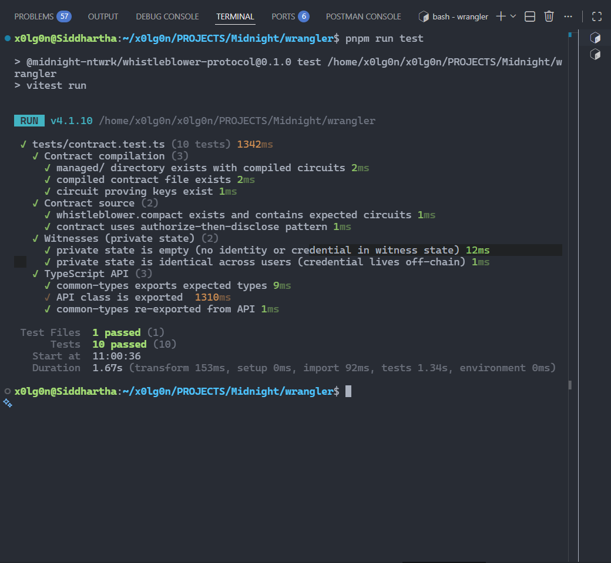

# Wrangler — Anonymous, ZK-Verified Feedback on Midnight

> **Midnight Challenge — Level 3: Half Moon** · Idea: **Anonymous Feedback / Survey**
>
> Submit feedback with a Zero-Knowledge proof that you are authorized — the ledger
> verifies the credential, records the message, and learns nothing about who you are.

[](https://github.com/x0lg0n/wrangler/actions)
[](https://github.com/x0lg0n/wrangler/actions)
[](https://www.typescriptlang.org/)
[](https://nodejs.org/)
[](https://midnight.network/)
[](LICENSE)

---

## 🌐 Live Demo

**[Wrangler](https://wrangler-midnight.vercel.app/)** — deployed to Vercel,
contract live on the **Midnight Preview network**.

The on-chain feedback count is read live from the indexer. To submit a piece of feedback,
open the **dashboard**, connect your **Midnight browser wallet** (the extension signs the
ZK transaction), and the wallet proves + submits on-chain. The deployed UI is configured via
environment variables instead of local files:

| Variable | Value |
|----------|-------|
| `MIDNIGHT_DEPLOYMENT` | JSON: `{ "address", "network", "deployer", "deployedAt", "authSecret" }` |
| `MIDNIGHT_FEEDBACKS` | JSON array of feedback entries (display seed, used until KV is seeded) |
| `KV_REST_API_URL` / `KV_REST_API_TOKEN` | Vercel KV (Upstash Redis) — shared store so new submissions appear in the public list for everyone (auto-attached when you create a KV store in the Vercel dashboard) |

---

## 🎥 Demo Video

Watch the full flow — deployment state, wallet connection, ZK-proving, and on-chain
submission (2.5 minutes):

<video src="./demo/wrangler-demo.mp4" controls></video>

Prefer watching elsewhere? [Open the demo video on Google Drive](https://drive.google.com/file/d/15t6jyyZLcFYVmNGRPjo596uKoMjolqjm/view?usp=sharing).

---

## 📸 Screenshots

| Compile Output | Contract Deployment (Preview) |
|:---:|:---:|
|  |  |
| `pnpm run compact` — circuits compiled | `pnpm run deploy --network preview` |

| Test Output (10/10 passing) |
|:---:|
|  |
| `pnpm test` — artifacts, circuits, API suite |

## 📋 Product Idea

DAOs, companies, and publications want honest feedback — but whistleblowers, employees, and
sources face retaliation when their identity is exposed. Centralized anonymous channels
(Blind, AllVoices) ask users to trust a third party that holds the identity database.

Wrangler replaces that trust with a Zero-Knowledge proof on the **Midnight Network**:

- An **authorization secret** is chosen at deployment and revealed to legitimate stakeholders.
- To submit, a stakeholder proves **knowledge of the secret** with a ZK circuit — the proof
  is verified on-chain, and the credential input itself never appears in the transaction.
- Feedback messages are **disclosed to the ledger**, producing a transparent, tamper-proof,
  append-only record that anyone can audit.
- The contract is minimal by design: two circuits (`initialize`, `submitFeedback`), one
  public counter, no third party, no identity database.

The system demonstrates Midnight's **authorize-then-disclose** pattern: selective disclosure
where authorization is proven privately and the feedback is published publicly.

---

## 🔐 Privacy Model — What an Observer Can and Cannot Learn

This is the heart of the protocol. The contract deliberately splits the world into public
and private:

| | Data | Example |
|---|------|---------|
| **Public (ledger)** | `feedbackCount`, `authorizationSecret` (disclosed at `initialize`), each feedback message | Anyone can query the indexer |
| **Private (witness)** | The credential input to `submitFeedback` | Only inside the ZK proof |
| **Private (wallet)** | Submitter's wallet / coin ownership | Shielded by Midnight's zswap |

**An observer of the ledger can learn:**

- The full text of every feedback message.
- Exactly how many feedbacks have been submitted (`feedbackCount`).
- The authorization secret — it is **disclosed during `initialize`** by design, so anyone
  who knows the secret can submit (which is the intended access model for anonymous feedback).
- The circuit logic itself (it's public source).

**An observer of the ledger cannot learn:**

- **Who submitted.** The proof verifies `credential == authorizationSecret` without the
  transaction carrying the credential input, and the submitting wallet's coins are shielded
  by Midnight's zswap — no address is linked to a submission.
- **The credential input** — it exists only inside the prover's witness, never on-chain.
- **Whether two feedbacks came from the same person** — there is deliberately no nullifier
  circuit, so a stakeholder may submit multiple times (surveys want repeated input; a
  nullifier can be added as a future circuit if one-vote-per-person is required).

**Design tradeoff:** because the secret is public after deployment, "authorization" here means
"prove you know the secret" — a lightweight access model that fits public surveys. For
membership-gated use, the secret would be replaced by a committed credential root, and the
witness would hold the credential itself.

---

## 🏗️ Architecture

```
┌─────────────────────────────┐        ┌──────────────────────────────────┐
│  Browser (Next.js UI)       │        │  Midnight Network                │
│                             │        │                                  │
│  FetchZkConfigProvider  ────┼──zk────▶  proving keys (served /zk)       │
│  in-browser WASM proving    │        │                                  │
│  Midnight wallet extension  │──tx───▶│  Node / relay  ──▶  Ledger        │
│                             │        │                                  │
└──────────────┬──────────────┘        └───────────────┬──────────────────┘
               │                                       │
               │  indexer (GraphQL v4)                 │
               └───────────────────────────────────────┘
                       dashboard reads contract state
```

- **UI** — Next.js 15 (App Router). Server components read contract state from the public
  indexer; the submit flow runs entirely in the browser: the wallet fetches proving keys
  from `/zk`, generates the proof in WASM, and signs the transaction.
- **Contract** — two Compact circuits on the Midnight ledger (see below).
- **CLI** — interactive terminal flow for submitting feedback with a funded wallet.

---

## ⚙️ Smart Contract

Written in [Compact](https://midnight.network/developers), Midnight's ZK smart-contract
language. Source: [`contract/src/wrangler.compact`](contract/src/wrangler.compact).

### Circuits

| Circuit | Purpose |
|---------|---------|
| `initialize(secret: Bytes<32>)` | One-time setup: asserts `feedbackCount == 0`, discloses the authorization secret |
| `submitFeedback(feedback, credential)` | Asserts `credential == authorizationSecret` (ZK proof of knowledge), discloses the message, increments the counter |

### Ledger State

```bash
feedbackCount:        Uint<16>      — total feedbacks submitted
authorizationSecret:  Bytes<32>     — disclosed at initialize; the submit credential
```

---

## 📁 Project Structure

```
wrangler/
├── contract/                  # Compact contract workspace
│   └── src/
│       ├── wrangler.compact  # Contract source — 2 ZK circuits
│       ├── witnesses.ts           # Private state factory (empty by design)
│       └── managed/               # Compiled circuits + proving/verifying keys
├── ui/                        # Next.js web interface (workspace)
│   ├── app/
│   │   ├── page.tsx               # Landing page
│   │   ├── dashboard/page.tsx     # Wallet-connected feedback dashboard
│   │   ├── status/page.tsx        # Deployment & contract status
│   │   ├── actions.ts             # Server actions (state reads, submission)
│   │   └── globals.css            # Design tokens (Tailwind v4)
│   ├── components/                # hero, features, dashboard-client, wallet-modal…
│   ├── lib/
│   │   ├── contract-server.ts     # Indexer queries + env/local state fallback
│   │   ├── contract-ledger.ts     # Pure-Buffer v6 state decoder (no WASM)
│   │   ├── client-contract.ts     # In-browser wallet proving & submission
│   │   └── server-contract.ts     # CLI subprocess submission path
│   └── public/zk/                 # Compiled circuits & keys for the wallet flow
├── api/                        # TypeScript contract API (workspace)
├── cli/                        # Interactive CLI (workspace)
├── tests/                      # Vitest suite
│   └── contract.test.ts            # 10 tests: artifacts, circuits, API
├── .github/workflows/ci.yml    # CI: compile → lint → typecheck → test → build
├── src/                        # Deployment & orchestration scripts (deploy, setup, cli)
└── screenshots/                # Submission screenshots
```

---

## 🚀 Quick Start

```bash
git clone https://github.com/x0lg0n/wrangler.git
cd wrangler
pnpm install
pnpm run build          # compile contract + API
pnpm run test           # 10 tests
npm run ui:dev          # Next.js dev server on :3000
```

Local devnet + deploy (requires Docker and compactc):

```bash
pnpm run setup          # docker → compact → build → deploy
pnpm run cli            # interactive CLI (credential: 0)
```

Preview network:

```bash
pnpm run network preview
docker compose up -d proof-server
# fund the wallet at https://faucet.preview.midnight.network
pnpm run deploy --network preview
```

---

## 🧪 Tests & CI

The contract, its compiled artifacts, and the API layer are covered by a Vitest suite
(`tests/contract.test.ts`):

```bash
pnpm test
```

- **Contract compilation** — compiled `managed/` circuits, generated contract API, keys
- **Contract source** — the `initialize` / `submitFeedback` circuits and the
  authorize-then-disclose pattern in `wrangler.compact`
- **Witnesses** — the private state is empty by design: no identity or credential lives in
  witness state; the credential is the off-chain input to `submitFeedback`
- **TypeScript API** — exported types and the `WranglerAPI` class

Every push to `main` (and every pull request) runs compile, lint, typecheck, tests, and the
UI production build via GitHub Actions — see [`.github/workflows/ci.yml`](.github/workflows/ci.yml).

---

## 🚢 Deployed Contract

Live on **Preview** (deployed 2026-07-30):

```bash
Contract Address: e1c5d3b6c75ef5671362e29bebbfc9a93d3507255bdf40b7530b63794ce60465
Deployer:         mn_addr_preview13pavsacgjvzpj8p6kwdn9lj6h8jymm9gtfs3ch5any5j06ry4qts9l8fdm
Network:          Preview
```

## 🌐 Networks

| Network | Indexer | Faucet |
|---------|---------|--------|
| Local | `http://127.0.0.1:8088` | N/A |
| Preview | `https://indexer.preview.midnight.network` | [Faucet](https://faucet.preview.midnight.network) |
| Preprod | `https://indexer.preprod.midnight.network` | [Faucet](https://faucet.preprod.midnight.network) |

Switch: `pnpm run network <name>`

## 📦 Commands

| Command | Description |
|---------|-------------|
| `pnpm run compact` | Compile Compact → managed circuits + keys (requires compactc) |
| `pnpm run build` | Build contract + API workspaces |
| `pnpm run test` | Run Vitest test suite (10 tests) |
| `pnpm run setup` | Docker + compact + build + deploy (all-in-one) |
| `pnpm run deploy` | Deploy contract to active network |
| `pnpm run cli` | Interactive CLI |
| `pnpm run check-balance` | Wallet balance |
| `pnpm run network` | Show/switch active network |
| `npm run ui:dev` | Next.js dev server (port 3000) |
| `npm run ui:build` | Build Next.js for production |

---

## 🤝 Contributing

See [CONTRIBUTING.md](CONTRIBUTING.md) for guidelines.

## 🛡️ Security

See [SECURITY.md](SECURITY.md) for vulnerability disclosure.

## 📄 License

Apache 2.0 — see [LICENSE](LICENSE).
