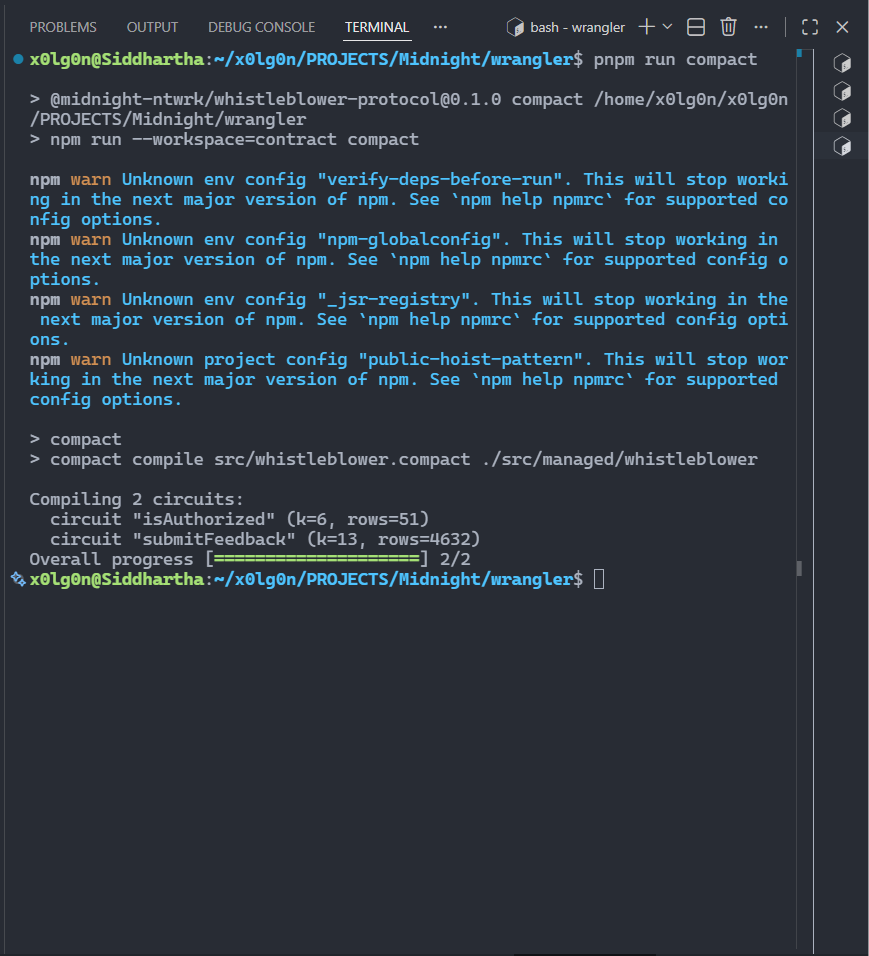
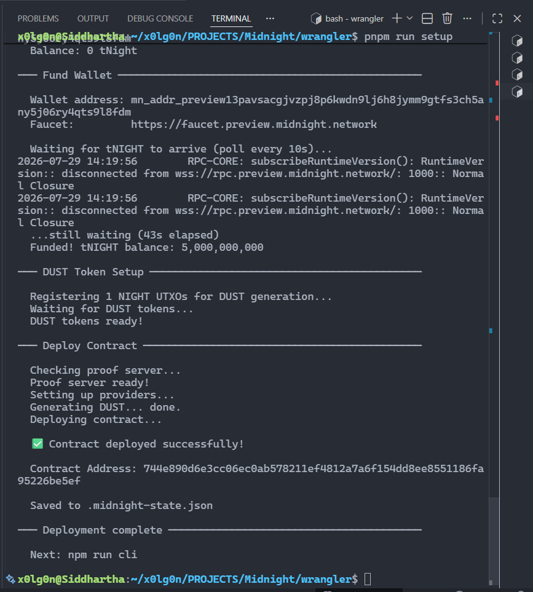

# ZK-Verified Whistleblower & Feedback Protocol

[](https://github.com/x0lg0n/wrangler/actions)
[](https://midnight.network/)
[](https://www.typescriptlang.org/)
[](LICENSE)
[](https://nodejs.org/)
[](https://github.com/x0lg0n/wrangler/actions)
[](CONTRIBUTING.md)

> **Midnight Challenge — Level 3: Half Moon** · Anonymous, ZK-verified feedback on the Midnight Network

---

## 📋 Product Idea

An anonymous, ZK-verifiable feedback platform for DAOs, enterprises, and journalism. Organizations publish on-chain credential roots, and verified stakeholders submit feedback without revealing their identity — not even their wallet address. The system guarantees every piece of feedback came from a legitimate stakeholder (via ZK proof), prevents double submissions (via cryptographic nullifiers), and publishes everything on the Midnight ledger for transparent, tamper-proof records. Unlike centralized alternatives (Blind, AllVoices), this protocol requires zero trust in a third party — mathematical proofs replace promises.

## 🚀 Quick Start

```bash
git clone https://github.com/x0lg0n/wrangler.git
cd wrangler
pnpm install
pnpm run build
pnpm run setup       # local devnet
pnpm run cli         # interactive CLI (credential: 0)
```

## 📸 Screenshots

| Compile Output | Contract Deployment (Preview) |
|:---:|:---:|
|  |  |
| `pnpm run compact` — 2 circuits compiled | `pnpm run deploy --network preview` — deployed to Preview testnet |

## 🧠 Overview

Organizations struggle to gather honest, critical feedback due to fear of retaliation. This protocol provides a **trustless solution** using Zero-Knowledge Proofs to mathematically prove that a user holds valid authorization credentials — without revealing those credentials or the user's wallet address to the network.

### Architecture

```
┌──────────────┐     ┌──────────────────┐     ┌─────────────────┐
│   User CLI   │────▶│  Proof Server    │────▶│  Midnight Node  │
│  (credential │     │  (Docker)        │     │  (ledger)       │
│   + feedback)│     │  ZK proof gen    │     │  proof verify   │
└──────────────┘     └──────────────────┘     └─────────────────┘
                            │                        │
                            ▼                        ▼
                     ┌──────────────────┐     ┌─────────────────┐
                     │  Private State   │     │  Public Ledger  │
                     │  (credential)    │     │  feedbackCount  │
                     │  never exposed   │     │  nullifierCount │
                     └──────────────────┘     │  sequence       │
                                              └─────────────────┘
```

## 🔐 Privacy Model: Public State vs Private Witness

The protocol operates across three tiers of data visibility:

| Tier | Data | Visibility | Cryptographic Guarantee |
|------|------|------------|------------------------|
| **Public Ledger** | `feedbackCount`, `nullifierCount`, `sequence`, `owner` | Everyone (on-chain) | Integrity via chain consensus |
| **Public Input** | `inputCredential` (field element) | Circuit input | ZK proof binds input to witness |
| **Private Witness** | Raw credential value | User's machine only | Never transmitted or stored on-chain |

The `isAuthorized` circuit proves `inputCredential == authorizationSecret` on-chain without ever revealing the credential. The `generateNullifier` circuit creates a deterministic public hash from the private credential — this hash prevents double-submission but cannot be reversed to identify the submitter.

## 📁 Project Structure

The root `src/` holds deployment & orchestration scripts (not part of any workspace package — they import from `contract/`, `api/`, and `cli/`). Each workspace (`contract/`, `api/`, `cli/`) has its own `src/` for its specific code. The `scripts/` folder has a build helper used during compilation.

```
wrangler/                          # Root: deployment scripts & orchestrator
│
├── src/                           # Deployment & orchestration scripts (root-level)
│   ├── deploy.ts                  #   Contract deployer (local, preview, preprod)
│   ├── setup.ts                   #   Docker → compile → deploy (all-in-one)
│   ├── cli.ts                     #   Runtime CLI with full wallet (credential: 0)
│   ├── network.ts                 #   Multi-network config manager (local/preview/preprod)
│   ├── wallet.ts                  #   Wallet creation, key derivation, lifecycle
│   ├── wallet-state.ts            #   Persistent wallet state (LevelDB serialization)
│   └── check-balance.ts           #   Wallet balance checker
│
├── contract/                      # Compact smart contract (workspace)
│   └── src/
│       ├── whistleblower.compact  #   Contract source — 3 ZK circuits
│       ├── index.ts               #   TypeScript contract entry (CompiledContract + witnesses)
│       ├── witnesses.ts           #   Private state factory (createWhistleblowerPrivateState)
│       └── managed/               #   Compiled ZK circuits, proving + verifying keys
│
├── api/                           # Contract interaction API (workspace)
│   └── src/
│       ├── index.ts               #   WhistleblowerAPI: deploy, join, submitFeedback, getFeedbacks
│       ├── common-types.ts        #   Provider & derived state types
│       └── utils/                 #   toHex, randomBytes helpers
│
├── cli/                           # Interactive CLI (workspace)
│   ├── src/index.ts               #   Terminal UI for feedback submission
│   ├── config.ts                  #   CLI configuration
│   └── midnight-wallet-provider.ts
│
├── ui/                            # Next.js web interface (workspace)
│   ├── app/
│   │   ├── layout.tsx             #   Root layout with dark theme
│   │   ├── page.tsx               #   Home page (contract status + feedback UI)
│   │   ├── globals.css            #   CSS variables, dark theme, primitives
│   │   └── api/
│   │       ├── contract/route.ts  #   GET — reads .midnight-state.json
│   │       └── feedback/route.ts  #   GET/POST — list/submit feedbacks
│   └── components/
│       ├── header.tsx             #   App header with network badge
│       ├── contract-status.tsx    #   Live contract deployment info
│       ├── feedback-form.tsx      #   Credential + message form
│       └── feedback-list.tsx      #   Feedback cards display
│
├── tests/                         # Vitest test suite
│   └── contract.test.ts           #   10 tests: artifacts, circuits, API exports
│
├── scripts/                       # Build helper scripts
│   └── copy-managed.mjs           #   Copies compiled circuits into dist/
│
├── screenshots/                   # Challenge submission screenshots
│   ├── compile-output.png         #   pnpm run compact — 2 circuits compiled
│   └── contract-deploy.png        #   pnpm run deploy — contract address on Preview
│
├── docs/
│   ├── ARCHITECTURE.md            # System design & data flow
│   └── DEVELOPMENT.md             # Dev workflow guide
│
├── docker-compose.yml             # Devnet services (node, indexer, proof-server)
├── package.json                   # Workspace root config
└── pnpm-lock.yaml                 # Dependency lock
```

## ⚙️ Smart Contract

The contract is written in [Compact](https://midnight.network/developers) — Midnight's ZK-smart contract language.

### Circuits

| Circuit | Type | Rows | Purpose |
|---------|------|------|---------|
| `isAuthorized` | Proof | 51 | Verifies `inputCredential == authorizationSecret` |
| `generateNullifier` | Pure | — | Deterministic hash: `persistentHash([credential, seq])` |
| `submitFeedback` | Composite | 4632 | Authorizes → nullifies → increments counters |

### Ledger State

```
feedbackCount:    Uint<16>        — total submissions
nullifierCount:   Uint<16>        — unique submitters
owner:            Bytes<32>       — deployer identity
authorizationSecret: Field        — authorized credential
sequence:         Counter         — monotonic nullifier seed
```

## 📋 Prerequisites

| Tool | Version | Install |
|------|---------|---------|
| Node.js | >= 24.11.1 | [nodejs.org](https://nodejs.org/) |
| pnpm | >= 9 | `npm install -g pnpm` |
| Docker | Latest | [docker.com](https://docker.com/) |
| compactc | 0.31.0 | [Midnight SDK](https://midnight.network/developers) |

## 🔧 Setup

### Local Devnet

```bash
# Install dependencies
pnpm install

# Compile Compact contract
pnpm run compact

# Build TypeScript packages
pnpm run build

# Start Docker services + deploy
pnpm run setup

# Run interactive CLI (credential: 0)
pnpm run cli
```

### Preview Network

```bash
# Switch network
pnpm run network preview

# Start only the proof server (devnet not needed)
docker compose up -d proof-server

# Fund wallet at the faucet, then deploy
# Visit https://faucet.preview.midnight.network with the wallet address shown below
pnpm run deploy --network preview
```

Currently deployed on Preview:
```
Contract Address: 744e890d6e3cc06ec0ab578211ef4812a7a6f154dd8ee8551186fa95226be5ef
Wallet Address:   mn_addr_preview13pavsacgjvzpj8p6kwdn9lj6h8jymm9gtfs3ch5any5j06ry4qts9l8fdm
```

### Preprod Network

```bash
pnpm run network preprod
docker compose up -d proof-server
pnpm run deploy --network preprod
```

### Troubleshooting

**Deploy stuck on "Waiting for faucet..."**
→ Manually request tNIGHT at [Preview Faucet](https://faucet.preview.midnight.network) or [Preprod Faucet](https://faucet.preprod.midnight.network)
→ Set shorter timeout: `MIDNIGHT_FAUCET_TIMEOUT_MS=300000 pnpm run deploy --network preview`

**Port conflicts**
→ `docker compose down` then retry
→ Check: `ss -tlnp | grep -E '6300|8088|9944'`

## 🧪 Tests

```bash
pnpm run test
```

10 tests covering:
- Contract compilation artifacts (managed directory, circuit keys, source integrity)
- Private state creation and credential isolation
- API type exports and module resolution

## 🌐 Networks

| Network | Indexer | Faucet | Proof Server |
|---------|---------|--------|-------------|
| Local | `http://127.0.0.1:8088` | N/A | Local Docker |
| Preview | `https://indexer.preview.midnight.network` | [Faucet](https://faucet.preview.midnight.network) | Local Docker |
| Preprod | `https://indexer.preprod.midnight.network` | [Faucet](https://faucet.preprod.midnight.network) | Local Docker |

Switch: `pnpm run network <name>`

## 📦 Commands

| Command | Description |
|---------|-------------|
| `pnpm run compact` | Compile Compact → managed circuits + keys |
| `pnpm run build` | Build all TypeScript packages |
| `pnpm run test` | Run Vitest test suite |
| `pnpm run setup` | Docker + compact + build + deploy (all-in-one) |
| `pnpm run deploy` | Deploy contract to active network |
| `pnpm run cli` | Interactive CLI |
| `pnpm run check-balance` | Wallet balance |
| `pnpm run network` | Show/switch active network |
| `pnpm run clean` | Reset local state |
| `npm run ui:dev` | Start Next.js dev server (port 3000) |
| `npm run ui:build` | Build Next.js for production |

## 🤝 Contributing

See [CONTRIBUTING.md](CONTRIBUTING.md) for guidelines.

## 🛡️ Security

See [SECURITY.md](SECURITY.md) for vulnerability disclosure.

## 📄 License

Apache 2.0 — see [LICENSE](LICENSE).

## 🧪 Tests & CI

The contract, its compiled artifacts, and the API layer are covered by a Vitest suite
(`tests/contract.test.ts`):

```bash
pnpm test
```

- Contract compilation: compiled `managed/` circuits, generated contract API, proving keys
- Contract source: the `initialize` / `submitFeedback` circuits and the authorize-then-disclose
  pattern in `whistleblower.compact`
- Witnesses: the private state is empty by design — no identity or credential lives in witness
  state; the credential is the off-chain `authorizationSecret`
- TypeScript API: exported types and the `WhistleblowerAPI` class

Every push to `main` (and every pull request) runs compile, lint, typecheck, tests, and the
UI production build via GitHub Actions — see [`.github/workflows/ci.yml`](.github/workflows/ci.yml).
Current status: [](https://github.com/x0lg0n/wrangler/actions)
